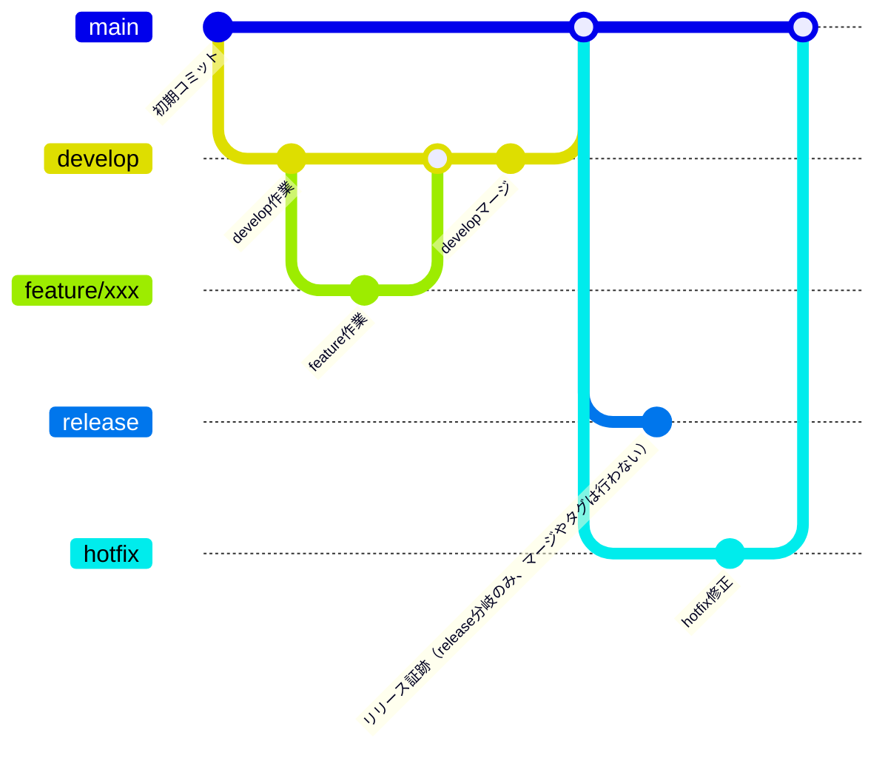

# プロジェクト概要
このリポジトリは、ゲームコミュニティ用のナレッジや学習内容を雑多にプッシュしていくリポジトリになります。
また、ris- で始まる各種リポジトリ（例: ris-front-info, ris-infra-core など）は、インフラ・開発共通の基盤として ris-infra-core リポジトリを中心にREADMEや構成、PRテンプレート、ビルド用シェルスクリプト等を管理しています。
運用や開発の詳細、共通ルール・テンプレートの最新版は ris-infra-core リポジトリを参照してください。

> **NOTE:**
> 本リポジトリのREADMEやPRテンプレート、ビルド用sh等は ris-infra-core で一元管理されており、運用ルールやテンプレートの最新情報は ris-infra-core をご確認ください。
> [ris-infra-core リポジトリはこちら](https://github.com/deidra-JP-windows/ris-infra-core)

## ディレクトリ・ファイル構成
雑多にナレッジや学習内容をまとめたリポジトリのため原則不要

## 開発環境セットアップ
### 必要な環境・ツール
- OS: Windows 11 以上（Mac/Linuxも可）
- 必須: `wsl`, `git`, `docker`, `openssh`（鍵作成）
- 推奨: VS Code（拡張機能「Dev Containers」）

### VS Code拡張機能（推奨）
- Draw.io Integration : VS Code上でDraw.io編集
- Markdown Preview Mermaid Support : Mermaid記法プレビュー

### 外部の拡張機能
効率的な開発を行う為、個人開発の拡張機能で以下の2つを採用しています。
- Draw.io Integration
  - VS Code で Draw.io を操作することが可能
- Markdown Preview Mermaid Support
  - マーメイド記法で書かれたコードをプレビューすることが可能

### 開発環境
以下のコマンドを`Git Bash`環境で実行してください。
コンテナ起動後、リポジトリを `Dev Containers` で開いてください。
```
# 初回起動時
bash build_command.sh first-up
```
```
# 起動時
bash build_command.sh up
```
```
# 接続時
bash build_command.sh exec
# 上記のコマンド、または Remote Explorer → Dev Containers からコンテナを選択し、Attach in New Window からコンテナを起動・接続してください。
```
```
# コンテナ停止時
bash build_command.sh stop
```
```
# イメージ更新時
bash build_command.sh rebuild
```
```
# コンテナ削除
bash build_command.sh down
```

### プッシュ
※リリースなどは原則行わない想定ですが、汎用的なフローとして順守してください。
github に差分をプッシュする際には git-flow を簡略化し運用してください。Github Actions などの実装を簡略化するためタグは使用しません。
- git-flow
  - https://www.atlassian.com/git/tutorials/comparing-workflows/gitflow-workflow

| ブランチ名      | 用途・説明                                      | 直接プッシュ禁止 | マージ先          | ブランチ作成元     |
|:---------------|:-----------------------------------------------|:----------------|:-------------------|:-------------------|
| main           | stg・prod 環境へリリースするブランチ               | ○               | -                 | -            |
| release        | 本番リリース後証跡｜切り戻し用ブランチ              | ○               | -                 | main          |
| hotfix         | main へ修正を入れる際に使用（リリース後のバグ修正等）| ×               | main              | main               |
| develop        | dev 環境へリリースするブランチ                     | ○               | main              | -  |
| feature/*      | 作業ブランチ（ローカル・dev 環境での動作確認も実施） | ×               | develop           | develop            |


### ブランチ運用フロー
※リリースなどは原則行わない想定ですが、汎用的なフローとして順守してください。
Mermaid 記法のため必要に応じて VS Code に拡張機能をインストールしてください。
例：Markdown Preview Mermaid


#### GitHub Actions連携ポイント
雑多にナレッジや学習内容をまとめたリポジトリのため原則不要

### コミットメッセージ
関数単位や同じ修正内容のまとまり単位でコミットしてください。
フォーマットに細かい指定はないですが、作業内容の概要だけ記載をお願いします。
例：[構成変更]_README修正

### PRテンプレート
本リポジトリでは、Pull Request 作成時に記入するためのテンプレート（.github/PULL_REQUEST_TEMPLATE.md）を用意しています。
PR作成時は以下のテンプレートを参考に、必要事項を記載してください。

#### 注意事項
- PRのタイトル・説明は分かりやすく記載してください。
- レビュワーが確認しやすいよう、必要に応じてスクリーンショットや補足説明を追加してください。
- テンプレートは`.github/PULL_REQUEST_TEMPLATE.md`で管理しています。必要に応じて編集・拡張してください。

### 実行
雑多にナレッジや学習内容をまとめたリポジトリのため原則不要

### デストロイ
雑多にナレッジや学習内容をまとめたリポジトリのため原則不要

## CI/CD（GitHub Actions）
雑多にナレッジや学習内容をまとめたリポジトリのため原則不要
### CI（継続的インテグレーション）
### CD（継続的デリバリー）

#### 補足
雑多にナレッジや学習内容をまとめたリポジトリのため原則不要

## GitHub運用方針
- **Collaborators and teams** で許可したユーザーのみWrite権限を付与し、不要なユーザーのpush権限を制限します。
- **rulesetの導入**により、以下のブランチ保護・セキュリティ強化を実施します。
  - mainブランチへの直接push禁止（必ずPull Request経由）
  - Pull Request必須・レビュー必須（例: 1名以上の承認）
    - コードオーナーによるレビューのみ
  - force push禁止
  - 必須ステータスチェック（CI等の成功を必須化）
    - 必要に応じて追加
    - Terraform コマンドは基本手打ちで実行する想定（Github Actions の実行に料金が発生する、PR作成前に確認してほしい等）
これらの設定により、リポジトリの安全性・品質を担保します。

## FAQ（よくある質問）
Q. Windows以外でも開発できますか？
A. 開発環境コンテナ操作用スクリプトが Windows 用のパス指定になっている為、 Mac/Linux 環境は未対応です。

Q. Dev Containersが起動しない場合は？
A. Docker Desktopの再起動やVS Codeの再起動をお試しください。

Q. SSH鍵の作成方法は？
A. `ssh-keygen -t ed25519` で作成できます。

Q. コマンドが失敗する場合は？
A. コンテナの状態（起動/停止）を確認し、必要に応じて`build_command.sh`を実行してください。

## サポート・問い合わせ
不明点や要望はGitHub Issuesまたは担当者までご連絡ください。
