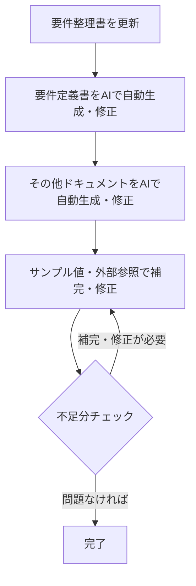
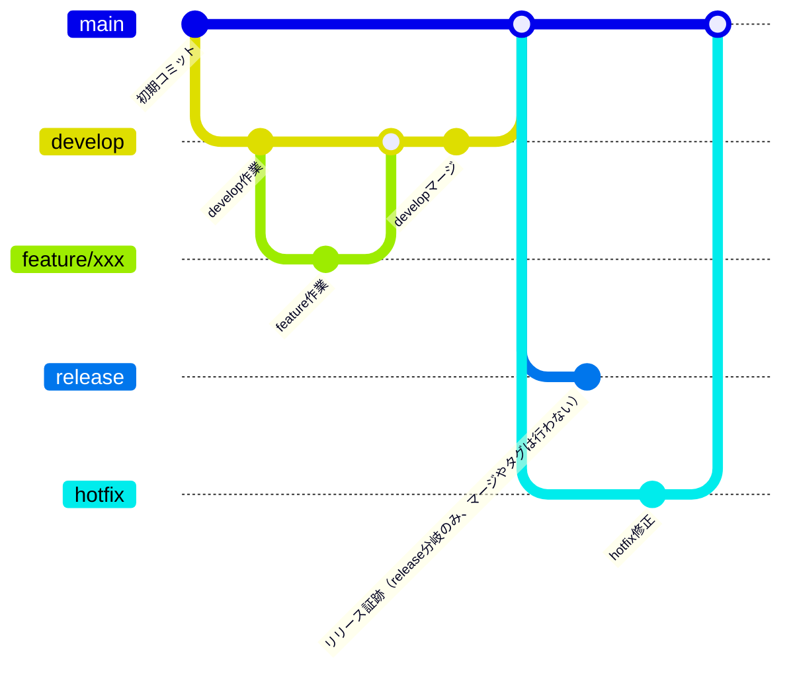

# プロジェクト概要
このリポジトリは、ゲームコミュニティ用ウェブサイトのインフラ構築・運用を目的としています。
AWSを中心としたIaC（Infrastructure as Code）による環境管理、関連ドキュメントの一元管理を行います。
運用効率・可読性を重視し、必要以上の工数をかけない方針です。

## ディレクトリ・ファイル構成
- `/diagram/` : システム全体の設計・運用に関するドキュメント（構成図、要件定義書、仕様書等）
- `/riften_web_infra/terraform/00_modules/` : Terraformモジュール群
- `/riften_web_infra/terraform/{ENV}/` : 環境別（dev, stg, prod）のTerraform構成
- `/riften_web_infra/tools/` : 開発Tipsや補助ツール、検証用コード
- `/build_command.sh` : 開発環境コンテナ操作用スクリプト
- `/Dockerfile` : 開発環境用Dockerイメージ定義

## ドキュメント一覧
要件整理書をたたき台として、他ドキュメントをAI（GitHub Copilot）で生成・更新しています。


- `アーキテクチャ図.drawio` : システム全体の構成・AWSリソース・外部連携のアーキテクチャ図
- `ER図.md` : サービスのエンティティ・リレーション図（Mermaid記法）
- `アクセスコントロール図.md` : RBAC・API経由のアクセス制御図
- `シーケンス図_メンテナンスページ.md` : CloudFrontメンテナンスページ切り替えのシーケンス図
- `シーケンス図_内部向けWEBサイトとスマホアプリのトークン認証.md` : 内部向けWEB/アプリの認証・データ連携シーケンス図
- `データフロー図.md` : Web/アプリ/バックエンド/S3間のデータフロー図
- `ネットワーク構成図.md` : AWSクラウド・クライアント間のネットワーク構成図
- `ワークフロー図.md` : 外部・内部ユーザの利用フロー全体図
- `要件整理書_RIFシステム.md` : サービス全体の要件整理（起点となるドキュメント）
- `要件定義書_RIFシステム.md` : 業務・機能・非機能要件の詳細定義
- `調達仕様書_RIFシステム.md` : 調達・契約関連仕様（参考ひな形）

## 開発環境セットアップ
### 必要な環境・ツール
- OS: Windows 11 以上（Mac/Linuxも可）
- 必須: `wsl`, `git`, `docker`, `openssh`（鍵作成）
- 推奨: VS Code（拡張機能「Dev Containers」）

### VS Code拡張機能（推奨）
- Draw.io Integration : VS Code上でDraw.io編集
- Markdown Preview Mermaid Support : Mermaid記法プレビュー

### 外部の拡張機能
効率的な開発を行う為、個人開発の拡張機能で以下の2つを採用しています。
- Draw.io Integration
  - VS Code で Draw.io を操作することが可能
- Markdown Preview Mermaid Support
  - マーメイド記法で書かれたコードをプレビューすることが可能

### 開発環境
以下のコマンドを`Git Bash`環境で実行してください。
コンテナ起動後、リポジトリを `Dev Containers` で開いてください。
```
# 初回起動時
bash build_command.sh first-up
```
```
# 起動時
bash build_command.sh up
```
```
# 接続時
bash build_command.sh exec
# 上記のコマンド、または Remote Explorer → Dev Containers からコンテナを選択し、Attach in New Window からコンテナを起動・接続してください。
```
```
# コンテナ停止時
bash build_command.sh exec
# 上記のコマンド、または Remote Explorer → Dev Containers からコンテナを選択し、Attach in New Window からコンテナを起動・接続してください。
```
```
# イメージ更新時
bash build_command.sh rebuild
```
```
# コンテナ削除
bash build_command.sh down
```

### プッシュ
github に差分をプッシュする際には git-flow を簡略化し運用してください。Github Actions などの実装を簡略化するためタグは使用しません。
- git-flow
  - https://www.atlassian.com/git/tutorials/comparing-workflows/gitflow-workflow

| ブランチ名      | 用途・説明                                      | 直接コミット禁止 | マージ先          | ブランチ作成元     |
|:---------------|:-----------------------------------------------|:----------------|:-------------------|:-------------------|
| main           | stg・prod 環境へリリースするブランチ               | ○               | -                 | -            |
| release        | 本番リリース後証跡｜切り戻し用ブランチ              | ○               | -                 | main          |
| hotfix         | main へ修正を入れる際に使用（リリース後のバグ修正等）| ×               | main              | main               |
| develop        | dev 環境へリリースするブランチ                     | ○               | main              | -  |
| feature/*      | 作業ブランチ（ローカル・dev 環境での動作確認も実施） | ×               | develop           | develop            |


### ブランチ運用フロー
Mermaid 記法のため必要に応じて VS Code に拡張機能をインストールしてください。
例：Markdown Preview Mermaid


#### GitHub Actions連携ポイント
- `feature/*` → `develop` へのPR作成・更新時：CI（Secret Scan）が自動実行され、機密情報混入をチェック
- `develop` → `main` へのマージ時：CD（Terraform Apply）が自動実行され、本番環境へ反映
  - それ以外のブランチ操作では自動実行されません

### コミットメッセージ
関数単位や同じ修正内容のまとまり単位でコミットしてください。
フォーマットに細かい指定はないですが、作業内容の概要だけ記載をお願いします。
例：[構成変更]_README修正

### PR事前作業
ソースを更新する際にはフォーマッタとバリデートのコマンドを実行・修正したのちPRを作成してください。
- フォーマッタ
```
cd /front-web-site-for-riften-terraform/riften_web_server/terraform/${ENV}
terraform fmt -recursive
```
- バリデータ
```
cd /front-web-site-for-riften-terraform/riften_web_server/terraform/${ENV}
terraform validate
```

### 実行
デプロイする各環境に対して実行してください。
```
cd /front-web-site-for-riften-terraform/riften_web_server/terraform/{ENV}
terraform init -var-file=terraform.tfvars
terraform plan -var-file=terraform.tfvars
terraform deploy -var-file=terraform.tfvars
```

### デストロイ
デストロイする各環境に対して実行してください。
```
cd /front-web-site-for-riften-terraform/riften_web_server/terraform/{ENV}
terraform destroy -var-file=terraform.tfvarss
```

## CI/CD（GitHub Actions）

### CI（継続的インテグレーション）
- **Secret Scan（.github/workflows/secret_scan.yml）**
  - developブランチへのPull Request作成・更新時に、Terraformディレクトリ配下のAWSキーやパスワード等の機密情報をgrepで検出し、見つかった場合はCIを失敗させます。
  - コード内にシークレット情報が混入していないか自動チェックします。
  - 誤検知を防ぐため、AWSリソース名に近いパターンは除外しています。

### CD（継続的デリバリー）
- **Terraform Apply（.github/workflows/terraform_apply.yml）**
  - mainブランチの`riften_web_infra/terraform/prod`配下に変更があった場合のみ、GitHub Actions上でTerraformのinit/plan/applyを自動実行します。
  - AWS認証情報はGitHub Secretsから取得し、CI環境で安全にapplyします。
  - 本番環境への自動反映を担うワークフローです。
  - applyはmainブランチへのpush時のみ自動実行され、PR作成時には実行されません。

#### 補足
GitHub Actionsは、CI（コード品質・セキュリティチェック）とCD（本番反映）を分離して運用しています。Terraformのapplyは本番環境のみ自動化し、PR作成時は手動検証を推奨しています。

## GitHub運用方針
- **Collaborators and teams** で許可したユーザーのみWrite権限を付与し、不要なユーザーのpush権限を制限します。
- **rulesetの導入**により、以下のブランチ保護・セキュリティ強化を実施します。
  - mainブランチへの直接push禁止（必ずPull Request経由）
  - Pull Request必須・レビュー必須（例: 1名以上の承認）
    - コードオーナーによるレビューのみ
  - force push禁止
  - 必須ステータスチェック（CI等の成功を必須化）
    - 必要に応じて追加
    - Terraform コマンドは基本手打ちで実行する想定（Github Actions の実行に料金が発生する、PR作成前に確認してほしい等）
  - シークレットスキャン（漏洩防止）
    - CI により実装
これらの設定により、リポジトリの安全性・品質を担保します。

## FAQ（よくある質問）
Q. Windows以外でも開発できますか？
A. 開発環境コンテナ操作用スクリプトが Windows 用のパス指定になっている為、 Mac/Linux 環境は未対応です。

Q. Dev Containersが起動しない場合は？
A. Docker Desktopの再起動やVS Codeの再起動をお試しください。

Q. SSH鍵の作成方法は？
A. `ssh-keygen -t ed25519` で作成できます。

Q. Terraformのバージョンは？
A. 各環境の`provider.tf`を参照してください。

Q. コマンドが失敗する場合は？
A. コンテナの状態（起動/停止）を確認し、必要に応じて`build_command.sh`を実行してください。

## サポート・問い合わせ
不明点や要望はGitHub Issuesまたは担当者までご連絡ください。
