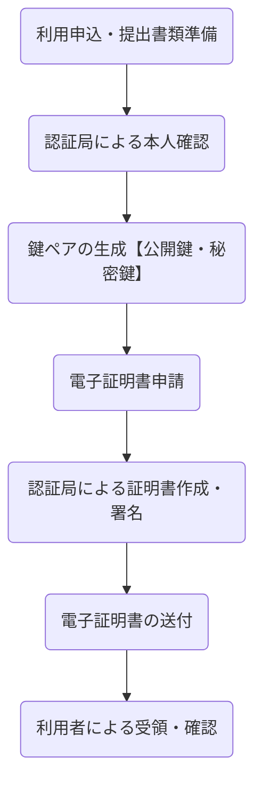
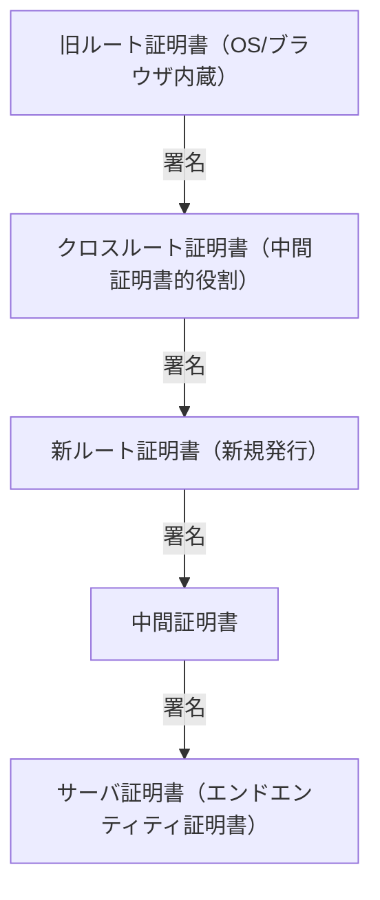

デジタル署名の“署名”とは、元データをハッシュ化（ハッシュ関数で要約）し、得られたハッシュ値を署名者の秘密鍵で暗号化するプロセスを指します。[1][3][4][8]

## デジタル署名の仕組みと手順

デジタル署名は、元データをハッシュ化（ハッシュ関数で要約）し、そのハッシュ値を署名者の秘密鍵で暗号化することで「本人性」と「改ざん防止」を実現します。[1][3][4][8]

| 手順 | 内容 | 目的 |
|:---|:---|:---|
| 1. データ準備 | 署名したい元データを準備 | 署名対象の決定 |
| 2. ハッシュ化 | 元データをハッシュ関数で要約 | データ圧縮・改ざん検知 |
| 3. 暗号化 | ハッシュ値を秘密鍵で暗号化 | 本人性証明 |
| 4. 署名送付 | 元データ＋暗号化ハッシュ値を受取人に送付 | データ流通 |
| 5. 署名検証 | 受取人が暗号化ハッシュ値を公開鍵で復号し、元データのハッシュ値と比較 | 改ざん検知＋本人性検証 |

**ポイント:** データそのものを暗号化するのではなく、“データの要約結果（ハッシュ値）”のみを署名用に暗号化します。

### 詳細な流れ
1. **データをハッシュ化**: 署名したい元データにハッシュ関数（例: SHA-256）を適用し、ハッシュ値（メッセージダイジェスト）を算出。
2. **ハッシュ値を秘密鍵で暗号化**: 署名者だけが持つ秘密鍵でこのハッシュ値を暗号化。これが「デジタル署名」本体。
3. **公開鍵で検証**: 受信者は公開鍵で署名（暗号化ハッシュ値）を復号し、元データのハッシュ値と一致するかを確認。一致すれば改ざんなし・本人性証明となる。

この方式の利点は「改ざん検知」「本人性証明」「処理速度と容量の効率化」です。

[1](https://keiyaku-watch.jp/media/kisochishiki/digital-signature/)
[2](https://biz.moneyforward.com/contract/basic/799/)
[3](https://act1.co.jp/column/0350-2/)
[4](https://www.freee.co.jp/kb/kb-trend/digital-signature/)
[5](https://www.gmosign.com/media/electronic-contract/post-denshisyomei/)
[6](https://www.infraexpert.com/study/security5.html)
[7](https://zerokara.dds.co.jp/signature/digitalsignature/)
[8](https://www.jipdec.or.jp/project/research/why-e-signature/PKI-crypto-mechanism.html)
[9](https://www.jpki.go.jp/prepare/pdf/denshisyomei.pdf)

## 電子署名とデジタル署名の違い — 電子署名法に基づいて解説

### 電子署名とは？

- 電子署名法（正式名称：電子署名及び認証業務に関する法律）では、「電子署名」を電子的方式で作成された文書の本人証明や非改ざん性の担保を目的とした電磁的措置の総称と定義しています。[1][5]
- 具体的には、「本人が作成したこと」や「文書が改ざんされていないこと」を証明できる技術すべてが電子署名となり、電子印鑑やタブレット端末へのサインも広く含まれます。[7][1]
- 電子署名は法的効力を持ち、電子署名法第３条では、本人性や改ざん防止が認められる場合に限り、書面による署名・押印と同等の効力があると規定されています。

### デジタル署名とは？

- デジタル署名は「電子署名」の一種で、公開鍵暗号やハッシュ関数を用いた高度なセキュリティ技術によって本人性・非改ざん性を保証するものです。[4][5][1][7]
- 仕組みとしては、署名者が自身の秘密鍵で電子文書に署名し、受取人は署名者の公開鍵でその署名を検証します。これにより、第三者によるなりすまし・改ざんを強固に防止できます。[5][6]
- デジタル署名には公開鍵証明書（電子証明書）やPKI（公開鍵認証基盤）の発行が必要で、セキュリティ性・証明力が非常に高いのが特徴です。[9]

### 法律上の位置づけ・違い

|                     | 電子署名                  | デジタル署名                    |
|---------------------|---------------------------|----------------------------------|
| 技術範囲            | 総称（広義）               | 一種（狭義、公開鍵暗号方式）     |
| 法律の定義           | 電子署名法で定義           | 電子署名法内の方式の一つ         |
| 証明できること       | 本人性・非改ざん性         | 本人性・非改ざん性（より強固）   |
| 具体的な技術例       | 電子印鑑、手サイン等        | 公開鍵暗号、電子証明書、PKI      |
| 法的効力            | 証明方式全般に効力あり      | より確実な証明手段として有効     |

> 電子署名法はデジタル署名を含む様々な技術を認めており、デジタル署名はその中でも特にセキュリティが高い方式です。電子契約や社会的な証明が求められる場面では、デジタル署名が推奨されています。[1][4][5][7][9]

### まとめ
- **電子署名**は電子的署名技術全般を指し、法律により本人確認や改ざん防止の手段として認められます。
- **デジタル署名**は電子署名の一種で、公開鍵暗号方式などを用いてさらに強固な本人証明と非改ざん性を担保する技術です。

電子契約や書類の真正性確保には、電子署名法に則った方式が必須となり、特に重要な契約ではデジタル署名が採用されることが増えています。[4][5][7][1]

[1](https://it-trend.jp/electronic-signature/article/263-109)
[2](https://biz.moneyforward.com/contract/basic/799/)
[3](https://www.cloudsign.jp/media/digitalsignature-vs-esignature/)
[4](https://keiyaku-watch.jp/media/kisochishiki/digital-signature/)
[5](https://group.gmo/security/ciphersecurity/encryption/blog/digital-signature/)
[6](https://dstmp.shachihata.co.jp/column/01200629/)
[7](https://www.gmosign.com/media/electronic-contract/digital-syomei/)
[8](https://www.adobe.com/jp/acrobat/roc/blog/digital-signature.html)
[9](https://www.jipdec.or.jp/project/designated-investigative-organization/faq/e-signatures.html)
[10](https://business.ntt-east.co.jp/service/ohs/column/electronic-sign/)

電子署名法では、本人性や改ざん防止を担保する技術（電子署名）の方式によって効力の強さが異なります。物理的な書類においても「押印」と「捺印」では効力が違い、これらの区分は電子文書でも参考にされます。[1][2][7][8]

下記の表で効力の違いと押印・捺印の差を整理します。

| 行為           | 意味・内容                          | 法的効力          | 特徴・備考                          |
|----------------|------------------------------------|-------------------|--------------------------------------|
| 記名のみ       | 氏名や会社名の印字・記載            | 弱い              | 複製が容易で証拠能力は低い           |
| 押印（記名押印）| 記名部分に印章（印鑑）を押す         | 中程度            | 民事訴訟法228条4項による効力発揮      |
| 署名のみ       | 自筆のサインのみ                    | 強い              | 筆跡鑑定も可能、証拠能力高い         |
| 捺印（署名捺印）| 自筆署名の横に印章を押す            | 最強              | 最も法的効力が高い、重要書類で利用    |
| 電子署名       | 本人性・改ざん防止技術（電子署名法方式）| 高い              | 本人性担保・改ざん検知・電子証明書等 |

### 解説

- **押印（記名押印）**は、記名（印字含む）に印鑑を押す行為で、書類の真正性の証明にはなるものの、捺印より効力が劣ります。主に領収書や日常書類で使われます。
- **捺印（署名捺印）**は、本人の自筆署名とセットで印鑑を押す行為。筆跡鑑定ができるため、本人性・真正性の観点で最も証拠力が高い形です。重要な契約書で多く採用されます。[2][7][8][1]
- **電子署名**の場合、「本人確認手段や改ざん防止策のレベルによって効力が変わる」という点が電子署名法にも規定されています。認定事業者の証明書付きなどでは捺印と同等以上の効力を発揮します。

> 紙書類では「署名＋捺印」が最強、電子文書では電子署名（特に認定型電子署名）が高い法的効力を持つと覚えておくとよいでしょう。[7][8][1][2]

[1](https://officenomikata.jp/coverage/11864/)
[2](https://zaitaku100.kokuyo.co.jp/work-style/526)
[3](https://hcm-jinjer.com/blog/e-sign/electronic-seal_seal/)
[4](https://www.cloudsign.jp/media/electronic_signature_seal/)
[5](https://keiyaku-daijin.com/media/sign-stamp)
[6](https://www.kddimatomete.com/magazine/230124171133/)
[7](https://biz.moneyforward.com/contract/basic/2000/)
[8](https://keiyaku-watch.jp/media/kisochishiki/imprint/)
[9](https://dstmp.shachihata.co.jp/column/02191008/)
[10](https://wan-sign.wanbishi.co.jp/blog/electronicsignature-signaturestamp)

## 認定型電子署名とは

認定型電子署名は、電子署名法に基づき「認定認証事業者」が発行する電子証明書（認定認証局）を利用して付与される電子署名です。署名者の本人確認を厳格に行った上で、第三者機関が発行した証明書によって、その電子署名が確かに本人の意思によるものと証明されます。[2][4][5][7][10]

### 特徴
- **本人確認**：認定認証局が厳格な審査で署名者の本人証明を実施
- **技術基準**：公開鍵暗号方式など一定以上の技術レベルが必要（例：RSA2048ビット以上）
- **法定推定効**：電子署名法第3条により「真正に作成されたものと推定」され、裁判でも強い証拠力
- **実印・印鑑証明に相当**：紙の実印＋印鑑証明書と同等以上の社会的・法的効力を持つ

## 電子署名で「捺印相当」の効力は可能？

認定型電子署名を利用すると、本人性や改ざん防止に加え、電子署名法の法的推定効（真正に作成された文書と見なされる効力）が働くため、紙の捺印（署名＋実印）と同等、あるいはそれ以上の効力を持たせることが可能です。[4][5][7][9][10][2]

### 比較表

| 行為                 | 本人性証明 | 改ざん防止 | 法的効力（証拠力） | 備考                                  |
|----------------------|------------|------------|--------------------|---------------------------------------|
| 紙の捺印（署名＋実印） | 強い       | 強い       | 最強（民事訴訟法で推定効）| 実印＋印鑑証明書                       |
| 認定型電子署名         | 強い       | 強い       | 最強（電子署名法3条で推定効）| 認証局による電子証明書                  |
| 一般的電子署名         | 中～強     | 中～強     | 中～強              | 認定認証局以外の証明、要件次第           |
| 手書き電子サイン       | 弱～中     | 弱         | 弱～中              | 技術・本人証明によって変動               |

> 認定型電子署名なら、紙の捺印（実印）と同じ効力、証拠力が日本国内で法的に認められているため、重要契約で利用可能です。[5][7][9][10][2][4]

[1](https://www.legalon-cloud.com/media/act-on-electronic-signatures-and-certification-business)
[2](https://biz.moneyforward.com/contract/basic/22266/)
[3](https://le-techs.com/content/blog/electronic-signature-4)
[4](https://www.cloudsign.jp/media/20210317-jigyousyasyomeigata/)
[5](https://www.cloudsign.jp/media/20181211-tokuteininsyougyoumu/)
[6](https://www.gmosign.com/media/electronic-contract/post-0124/)
[7](https://wan-sign.wanbishi.co.jp/blog/legaleffect-definition)
[8](https://keiyaku-daijin.com/media/effect-econtract)
[9](https://www.smbc.co.jp/hojin/magazine/general-affairs/features-of-electronic-contracts.html)
[10](https://jp.globalsign.com/documentsigning/about/digitalsignature_law.html)

認証子とは、情報システムやセキュリティ分野において「本人認証」を行うために使われる識別情報や手段（例：パスワード、指紋、ワンタイムコードなど）の総称です。  
英語では「Authenticator」と表記され、ID・パスワード、認証アプリ、ICカードなど多様な形式があります。[1]

### 署名との関連性
電子署名における「認証子」は、署名を行う本人しか持たない秘密鍵や電子証明書、さらにそれを利用する際のパスワードなどを指す場合が多いです。[6]
認証子の適切な管理ができていれば「本人しか文書に署名できない」状態となり、電子署名法第3条の要件を満たします。  
つまり、署名者が本当に本人かを担保する技術＝認証子となります。

| 用語     | 概要                                | 電子署名での役割                                      |
|----------|-------------------------------------|------------------------------------------------------|
| 認証子   | 本人認証を行う情報・手段             | 秘密鍵・電子証明書・PINやパスワード等に該当           |
| 署名     | 本人の意思で文書へ残す証明行為       | 認証子（秘密鍵所有者）だけが可能な電子的証明           |

> 認証子は、署名者の本人性を保証するための「鍵」や「証明手段」であり、署名の信頼性・法的効力を担保します。電子署名の信頼度は認証子の強度・管理状況に大きく依存します。[3][1][6]

[1](https://qiita.com/lemiyachi/items/f33ecc79676e7406c1bc)
[2](https://www.c-a-c.jp/about/knowledge.html)
[3](https://www.jipdec.or.jp/project/research/why-e-signature/certification-business.html)
[4](https://jp.globalsign.com/documentsigning/about/digitalsignature.html)
[5](https://dstmp.shachihata.co.jp/column/02191008/)
[6](https://www.jipdec.or.jp/project/designated-investigative-organization/faq/e-signature-law-and-regulations.html)
[7](https://www.jnsa.org/jnsapress/vol15/15_03-11.pdf)
[8](https://laws.e-gov.go.jp/law/414AC0000000153)
[9](https://www.nic.ad.jp/ja/newsletter/No80/NL80_0800.pdf)

## 認定認証局とは

**認定認証局**（CA: Certificate Authority）は、電子証明書を発行・管理する機関です。認証局は申請者の本人確認を厳密に行い、その公開鍵が申請者本人のものであることを証明する電子証明書を発行します。電子証明書は、インターネット上で本人の正当性や実在性を保証する役割を担います。[1][6][8]

***

## 証明書の署名・暗号化時の利用例

### 電子署名の流れ

1. **証明書発行**
   - 利用者は信頼できる認定認証局に電子証明書発行を申請。
   - 認証局は本人確認後、電子証明書（公開鍵付きの身分証）を発行します。[6][8]

## 認定認証局（CA: Certificate Authority）

認定認証局は、電子証明書を発行・管理する機関です。申請者の本人確認を厳格に行い、その公開鍵が本人のものであることを証明する電子証明書を発行します。電子証明書はインターネット上で本人の正当性や実在性を保証する役割を担います。[1][6][8]

---

### 電子証明書の主な利用例

#### 電子署名の流れ
1. **証明書発行**: 利用者が認定認証局に申請し、本人確認後に電子証明書（公開鍵付き身分証）が発行される。[6][8]
2. **文書署名（送信側）**: 電子文書をハッシュ化し、申請者（送信者）が自身の秘密鍵でハッシュ値を暗号化（署名）。電子署名と証明書を文書に添付し送信。[2][5][8]
3. **署名の検証（受信側）**: 受信者は文書から新たにハッシュ値を生成し、証明書の公開鍵で署名を復号。ハッシュ値が一致すれば改ざんなし。証明書の有効性も認証局で確認。[5][8][1]

#### 暗号化での利用例
- 電子メールや社内機密文書の暗号化に、認証局発行の公開鍵が利用されます。送信側が受信者の公開鍵で暗号化し、受信者が自身の秘密鍵で復号します。これにより第三者への漏洩を防ぎます。[7]

---

### 主な利用事例

| 分野       | 利用例                   | 説明                                                        |
|:-----------|:-------------------------|:------------------------------------------------------------|
| 電子契約   | 契約書・請求書等への署名 | 契約主体の正当性を認定認証局が保証し、改ざん防止[7][8]       |
| 電子申請   | 官公庁・自治体への申請   | 申請者本人確認・手続きの効率化                              |
| 電子商取引 | 発注書・見積書・承認書等 | 取引内容の非改ざん性・本人確認[7]                           |
| 保存文書   | 税務帳簿・医療記録       | 証憑文書の真正性・保存性を証明[7]                           |
| 業務記録   | 社内文書・稟議書         | 決裁や承認プロセスのデジタル化と記録の真正性保証[7]          |
| メール     | 署名・暗号化              | 送信者の真正性と内容の安全性確保[7]                         |

---

### まとめ

認定認証局は、**電子証明書を発行・管理し、電子署名や暗号化に不可欠な安全性・真正性の基盤**です。証明書によって本人性の証明、署名情報の検証、暗号化通信など、電子社会の多様な安全保障に活用されています。[8][1][2][5][6][7]

## 証明書の有効性確認の流れ

### 1. 証明書チェーンの構造

- **証明書チェーン**は、対象証明書（エンドエンティティ証明書）、中間証明書、そして最上位の**ルート証明書**で構成されます。
- **ルート証明書**は高い信頼性を持ち、通常はOSやブラウザなどに事前にインストールされています。[7][8]
- 中間証明書はルート証明書により署名され、エンドエンティティ証明書は中間証明書で署名されます。これにより、信頼の連鎖（チェーン）を構成します。

***

### 2. ブラウザやOSに保存されているルート証明書

- ChromeやEdgeなど主要な**ブラウザ**やWindows、macOSなどの**OS**は、認定されたルート認証局のルート証明書を内蔵しています。
- WebサイトのSSL/TLS証明書や電子署名検証時は、まず証明書チェーンを辿ってルート証明書まで遡り、「このルートCAが信頼されているか」を確認します。[8][7]

***

### 3. 有効性確認の実際の流れ

1. **署名された電子証明書を受け取る**
2. **証明書チェーンを検証**
   - 証明書に添付された中間証明書・ルート証明書を辿り、「信頼できるルートCAまでの署名の連鎖」を確認します。
   - ルート証明書がブラウザ・OSに保存済みなら「信頼OK」と判断されます。
3. **証明書の内容（発行者・利用者名など）と有効期間を確認**[1][2][7]
4. **失効情報の確認**
   - **CRL（Certificate Revocation List）方式**：失効証明書一覧を認証局サーバから定期取得し、証明書のシリアル番号が載っていないかチェックする。オフラインでも一括検証可能。[4][9]
   - **OCSP（Online Certificate Status Protocol）方式**：リアルタイムで認証局のサーバに証明書のステータスを問い合わせ、失効していないか確認する。[9][4]

## 証明書の有効性確認の流れ

### 証明書チェーンと信頼の仕組み

- **証明書チェーン**は、エンドエンティティ証明書・中間証明書・ルート証明書で構成されます。
- **ルート証明書**はOSやブラウザに事前インストールされており、信頼の起点となります。[7][8]
- 中間証明書はルート証明書で署名され、エンドエンティティ証明書は中間証明書で署名されることで、信頼の連鎖（チェーン）が成立します。

### 有効性確認の流れ

1. **電子証明書の受領**
2. **証明書チェーンの検証**
	- 添付された中間証明書・ルート証明書を辿り、信頼できるルートCAまでの署名連鎖を確認
	- ルート証明書がブラウザ・OSに保存済みなら「信頼OK」
3. **証明書内容と有効期間の確認**[1][2][7]
4. **失効情報の確認**
	- **CRL（失効リスト）**：認証局サーバから失効証明書一覧を取得し、該当しないか確認[4][9]
	- **OCSP（オンライン失効確認）**：認証局サーバにリアルタイムで証明書の状態を問い合わせ[9][4]
5. **署名の検証**
	- 証明書の公開鍵で電子署名を検証し、改ざんや発行者の正当性を確認[1][7][8]

### 有効性検証のポイント

- 有効期間内であること
- 失効していないこと（CRL/OCSP方式）
- 証明書チェーンが正しく構成され、ルート証明書が信頼済みであること
- 証明書の記載情報（利用者名など）が適切であること

---

### まとめ

エンドユーザや受信側は、証明書チェーンを辿ってOSやブラウザにインストール済みのルート証明書まで検証し、証明書の内容・有効期間・失効情報（CRL/OCSP）なども確認して、電子署名やSSL通信の安全性を総合的にチェックしています。[2][4][7][8][9][1]

## 電子証明書発行の流れ

### 詳細な手順

1. **利用申込・提出書類準備**
	- 認証局が指定した申込方法や書類を準備
2. **認証局による本人確認**
	- 申込書類をもとに厳正な本人確認
3. **鍵ペアの生成**
	- 公開鍵・秘密鍵を生成（利用者自身または認証局で生成し、ICカード等で送付）
4. **証明書申請**
	- 公開鍵＋申込情報を認証局へ提出
5. **認証局による証明書作成・署名**
	- 本人性確認の上、認証局が電子証明書を作成し、自ら署名を付与
6. **電子証明書の送付**
	- 安全な方法（PIN付き等）で利用者に送付
7. **利用者による受領・確認**
	- 内容確認・受領証返送、記載内容や署名の有効性も検証

---

### 電子証明書に含まれる主なデータ例

| 項目名                | 内容例                                 |
|-----------------------|----------------------------------------|
| バージョン            | 証明書のバージョン（例：v3）           |
| シリアル番号          | 一意に識別する番号                     |
| アルゴリズムID        | 署名アルゴリズム（例：SHA256WithRSA）   |
| 発行者（Issuer）      | 認証局名                               |
| 有効期間              | 発行日・有効期限（NotBefore/NotAfter） |
| 被証明者（Subject）   | 主体情報（氏名、会社名等）             |
| 公開鍵                | 利用者公開鍵                           |
| 拡張領域              | 用途制限、代替名など                   |
| デジタル署名          | 認証局による証明書への署名             |

必要に応じて「失効情報（CRL配布先URL）」や「SubjectAltName（メールアドレス等）」なども付与されます。

## 中間証明書の検証と証明書チェーン

中間証明書の確認は、一般的に「証明書チェーンの検証」として行われます。主な流れは以下の通りです。

### 検証の流れ

1. サーバ証明書（エンドエンティティ証明書）が提示される際、多くの場合は中間証明書もサーバから一緒に送信されます。
2. クライアント（PCやブラウザなど）は、中間証明書を受信し、ローカルに保存されているルート証明書と照合します。
3. クライアントは、サーバ証明書を署名した中間証明書を検証し、さらにその中間証明書を署名したルート証明書が信頼済みかを確認します。
4. この連鎖（証明書チェーン）が正しく構成されていれば、証明書は有効と判断されます。

### 補足

- 中間証明書がサーバから送られてこない場合や不足している場合、クライアント側（ブラウザやOSの証明書ストア等）に事前にインポートしておくことで検証を補完できます。

> 中間証明書はサーバ証明書とセットで送られてくるものをクライアントが検証するのが基本です。信頼の連鎖（証明書チェーン）の構成が、証明書の有効性判断の重要な材料となります。

### 中間証明書の添付と検証運用のポイント

- デジタル署名やSSL通信では、**自身の証明書と中間証明書をセットで送付・添付**するのが一般的です。
- 受信側（ブラウザやメールクライアント等）は、署名証明書と中間証明書を使い、**ルート証明書までの信頼チェーンが成立するか**を自動で検証します。
- サーバや署名クライアントの設定では、**証明書チェーン（自身＋中間）を必ず組み込む**ことが推奨されます。
- これにより、相手側の環境で**正しく信頼性（トラストチェーン）の検証**が行えます。

> 中間証明書の添付漏れやチェーン不備があると、受信側で「信頼できない証明書」と判定されるため注意が必要です。

---

### クロスルート証明書（Cross Root Certificate）とは

クロスルート証明書は、**異なるルート証明書同士が互いの信頼性を橋渡しするために発行される証明書**です。
新しいルート証明書を使い始めた際、既存の広く信頼されているルート認証局（CA）に署名してもらうことで、旧ルート証明書の環境でも新ルート証明書の信頼性を担保できます。

#### 必要性と仕組み
- OSやブラウザには既存のルート証明書が保存されているが、新しいルート証明書は含まれていない場合がある
- 古い端末やブラウザでは新ルート証明書を検証できず、通信や署名がエラーになることがある
- クロスルート証明書は、旧ルート証明書が新ルート証明書を間接的に信頼できるようにする橋渡し役

#### 構造イメージ

- 古い環境: 「旧ルート → クロスルート → 新ルート → 中間 → サーバ証明書」で検証
- 新しい環境: 「新ルート → 中間 → サーバ証明書」で検証

#### 利用例
- 新しいルート証明書でSSL/TLS証明書を発行するときにクロスルート証明書を配布
- 古いブラウザやOSでSSL接続を行う際の互換性確保
- ルート証明書更新期間中の段階的な移行支援

#### まとめ
クロスルート証明書は、異なるルート証明書間での「信頼橋渡し」を実現し、証明書の検証互換性やシームレスな新旧ルート証明書移行をサポートする重要な仕組みです。
